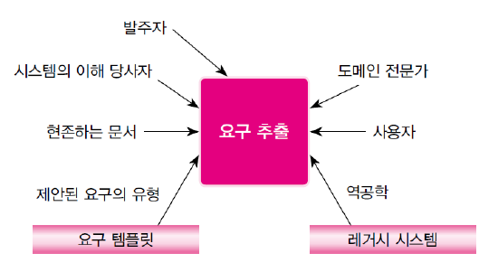

## 소프트웨어 요구사항

#### 소프트웨어 요구란?

⭐️ 시스템에 대한 고객의 요청을 확정한 것 <br>
⭐️ 진정한 요구를 찾는 것은 프로젝트 성공의 필수 조건이지만 진정한 요구를 찾아내기에는 <u>**제약사항**</u>들이 존재

<u>제약사항</u>? <br>
제약사항은 소프트웨어 시스템의 해결책을 제한한다.<br>
제약은 여러 가지 설계 구현안을 줄인다는 점 <br>
요구와 제약은 요구 분석 명세서에 우선순위 표시와 함께 잘 정리되어야 함 <br>

<br>

**요구분류**

|      |                                                                  기능 요구                                                                   |                                                                                    비기능 요구                                                                                    |
| :--: | :------------------------------------------------------------------------------------------------------------------------------------------: | :-------------------------------------------------------------------------------------------------------------------------------------------------------------------------------: |
| 정의 |                                                          시스템의 기능에 대한 요구                                                           |                                                                    시스템이 제공하는 기능과는 관련이 없는 요구                                                                    |
| 특징 | 고객이 요구하는 시스템이 처리할 기능 <br> 업무 절차나 기계 동작을 실현한 것<Br>동사로 표현됨<Br>쉽게 파악됨<Br>제품 기능<Br>사용 사례로 정리 | 요청된 기능 이외에 시스템이 갖추어야 할 조건과 특징<Br>응답 속도, 고장에서 회복되는 기간, 보안 등<Br>형용사로 표현됨<Br>파악하기 어려움<Br>제품 속성<Br>품질 속성 시나리오로 정리 |

<Br>
<hr>

**기능 요구? 비기능 요구?**

<u>기능요구란</u>?

시스템이 외형적으로 나타내는 기능과 동작 <br>
예를 들어 현금인출기에서의 기능 요구는 현금의 인출, 잔금 조회, 계좌 이체 같은 것들이 된다.<br>
시스템이 데이터나 인스트럭션에 대해 반응하는 동작, 상태의 변화도 기능요구이다.<br>
기능요구는 **외부 사용자에게 직접적으로 혜택을 줄 수 있는 시스템의 기능**을 말함

<br>

<u>기능요구에 포함되어야 하는 사항들</u>

- 입력의 검증
- 정확한 작업 순서
- 비정상적인 상태(오버플로우, 네트워크 오류)에 대한 응답 및 복구
- 매개변수의 유효성
- 입출력 관계

<br>

<u>비기능 요구란</u>?

시스템이 제공하는 기능에 직접 관련되지 않은 요구
기능요구를 지원하기 위하여 파생적으로 필요한 요구이다.

<u>비기능 요구의 종류</u>

- 외부 인터페이스
- 메모리 제약
- 성능 요구 : 처리량, 반응 속도, 실시간 처리, 자원 이용률 등..
- 사용자의 특성과 가정
- 설치 환경의 적합성

<br>
<hr>

**요구사항 대상에 의한 분류**

- 비즈니스 요구 - 소프트웨어 적용 업무 사례로부터 획득하는 요구사항
- 아키텍처 및 설계 요구 - 비즈니스 요구보다 더 상세한 요구사항, 구현에 필요한 전체적인 설계 및 관련 요구사항
- 시스템 및 통합 요구 - 개발자가 코딩하는 데 필요한 아주 상세한 요구사항

<br>

|       요구 종류       |                                                                                                                                                            사례                                                                                                                                                             |
| :-------------------: | :-------------------------------------------------------------------------------------------------------------------------------------------------------------------------------------------------------------------------------------------------------------------------------------------------------------------------: |
|     비즈니스 요구     |                                                                                                                                                   잔액 조회<br>계좌 이체                                                                                                                                                    |
| 아키텍처 및 설계 요구 | - 고객이 인터넷 뱅킹에 로그인 하고 자동이체를 사용하는 방법을 예시로 든다.<br>- 고객은 등록된 자동이체 대시 보드를 볼 수 있다<br>청구 세부 정보를 추가, 수정 및 삭제 할 수 있다<br>- 고객은 CMS를 구성하고 다양한 이체 작업에 대한 문자 알림을 전 휴대폰으로 보낼 수 있음<br>- 과거 지급된 자동이체의 기록을 볼 수 있음<br> |
|  시스템 및 통합 요구  |                                                                   - 유틸리티 제공자 이름<br>- 관계/고객 번호<br>- 자동 결제 - 예/아니오<br>- 전체 청구서 지급 - 예/아니오<br>- 자동 지급 한도 - 청구 금액이 지정된 금액을 초과하는 경우 지급하지 않는다.                                                                    |

<br>
<hr>

#### 사용자의 요구를 추출하는 방법

**요구 추출**

⭐️ 사용자가 무엇을 원하는지 결정을 내리는 작업, 여러가지 기법이 동원

**요구 추출을 위한 세 단계의 작업**

1. 요구에 대한 정보 출처 파악
2. 요구에 대한 정보 취합
3. 요구와 제한 사항 정리

**요구추출 방법**

- 고객의 발표
- 문헌, 양식 조사
- 인터뷰
- 설문
- 브레인스토밍 회의
- 관찰과 작업 분석
- 프로토타이핑

<br>
<hr>

**요구정보 출처**

⭐️ 요구 추출 작업은 정보의 수집이 필요함 → 어디서 정보를 얻느냐?(출처)를 알아야 함



- 고객

프로젝트 유치, 재정적 지원, 운명을 결정하는 당사자
소수이지만 재정적인 지원을 맡으며, 중요한 의사결정을 함 → 프로젝트에 상당한 영향력을 행사함

- 도메인 전문가

비즈니스 도메인을 지원하는 시스템을 구축하기 위해 필요한 사람
예를 들어 회계 시스템 구축을 위해 회계사가 필요함

- 이해 당사자

시스템 운용으로 인하여 영향받는 사람들
시스템의 사용자가 될 수도 있고 아닐 수도 있다
주된 관심은 비즈니스 목표, 규칙등에 부합하는 가를 확인하는 것

- 사용자

시스템을 직접 사용하는 사람들
주 사용자 - 업무 프로세스에 참여하여 무엇을 하는지 뿐만 아니라 왜 해야 하는지도 안다
단순 운영자 - 주 사용자를 보조, 반복 업무만 수행 가능

- 역공학

레거시 시스템(낡은 기술, 방법론) 이랑 현재 문서는 업무 규칙에 대한 풍부한 출처가 될 수 있음
이러한 어플리케이션, 문서, 규정등을 파헤치는 것

<br>

**요구 추출 뷰 포인트**

요구를 추출할 때 기준이 되는 관점<br>
개발자는 시스템에 대한 다양한 관점을 인식하여 다양한 요구사항들을 받아 냄<br>
→ 요구사항에 모순이 있을 때 발견하기 쉬운 틀이 제공되기 때문<br>

<br>

- 상호작용 관점(Interaction Viewpoint)

대상 시스템을 직접 조작하는 사람이나 직접 정보를 교환하는 시스템의 관점
시스템의 기능과 인터페이스를 결정하는 구체적인 요구를 제시
예시 : 현금자동인출기(ATM)에서 ATM을 사용하는 고객, 계정을 관리하는 DB의 관점

<br>

- 간접 관점(Indirect Viewpoint)

대상 시스템을 직접 조작하는 것은 아니지만, 어떤 상태로든 영향을 미치는 이해 관계자의 관점
비교적 높은 조직의 요구와 제약을 규정(추상적인 요구)
예시 : ATM의 경우 관리부서의 직원, 보안요원

<br>

- 도메인 관점(Domain Viewpoint)

대상 시스템의 요구사항에 영향을 미치는 응용 영역의 특징과 제약사항
대상 시스템의 범위를 선정하는 데 도움을 줌
이미 설치된 다른 시스템과 연동함, 개발할 때 다른 시스템과의 연계를 계획해야 함
예시 : ATM의 경우 은행 사이 상호작용이 가능하게 한 통신 표준기술

<br>
<hr>

#### 요구분석

⭐️ 요구 후보를 분석하고 결정하여 요구로 확정하는 단계

<br>

요구사항이 다음과 같은 성질을 가지는 지 분석해야 함

- 원자적(atomic) - 요구사항이 단일 목적을 가지는 성질
- 완전성(complete) - 요구사항 속에 정의된 것이 정보의 모든 것을 포함
- 비모호성(unambiguous), 통일성(consistent) - 명확하지 않는 것을 기술, 같은 내용을 다르게 언급하지 않는 성질
- 추적성(traceable) - 요구사항을 쉽게 추적할 수 있도록 고유번호를 부여
- 우선순위화(prioritize) - 요구사항의 중요도를 파악할 수 있는 성질
- 테스트 가능성(testable) - 요구사항이 검증 가능하도록 기술되어 있는 특성

<br>

**도메인분석**

도메인 - 요구의 배경을 의미

도메인 분석 - 응용분야(현실)에 존재하는 개념을 잘 정의하고 분석하여 시스템에 존재하는 개념으로 정립하는 단계

<br>

<u>왜 분석하는가</u>?

설계 모델링에 필요한 여러 개념과 비즈니스 규칙을 파악하기 위함
도메인 분석 방법

- 도메인 개념 찾기

도메인 개념 : 도메인의 목적, 구조, 동작을 구성하는 객체, 프로세스, 사람, 규칙과 같은 것들
프로젝트 초기에 개념을 세우기 위해 용어를 바르게 정의하는 것이 중요함

<br>

- 도메인 사전 작성

도메인 사전 : 시스템과 관련된 도메인 개념을 조직화 한 것
사전의 각 항목 - 용어가 사용 될 때는 언제든 같은 의미로 통하게 하는 간결한 정의

<br>

- 비즈니스 규칙 정리

비즈니스 규칙 - 업무에서 지키기로 정한 규정

<br>

**시나리오기반 분석**

⭐️ 다양한 사람들이 참여하여 다양한 용어와 개념을 전달하여 요구를 도출함

**5W1H 원칙** (육하원칙) 사용

사용자 스토리

<u>_애자일 방법_</u>에서 요구 파악에 많이 사용하는 방법
대상 시스템이 제공해야 할 기능 하나를 일정한 형식의 한 문장으로 정의하는 것

```
< 사용자/역할 (who) >는
< 목표/혜택/이익 (why) >를 얻기 위하여
< 행위/작업 (what) >을 원한다.
```

위와 같은 형식에 맞추어 사용자 스토리를 작성한다.

<br>
<hr>

#### 요구명세

⭐️ 명세 - 분석한 요구사항을 모두 빠짐없이 명확하게 작성하는 것<br>
⭐️ 요구분석 명세서(SRS - Software Requirement Specification) - 명세한 문서

<br>

**요구명세 목차**

|       목차        |                                                                              소항목                                                                              |
| :---------------: | :--------------------------------------------------------------------------------------------------------------------------------------------------------------: |
|       소개        |                                     1.1 SRS의 목적<br>1.2 제품의 범위<br>1.3 정의, 동의어, 약어<br>1.4 참조문서<br>1.5 개요                                      |
| 일반적인 기술사항 |                                   2.1 제품의 개관<br>2.2 제품의 기능<br>2.3 사용자 특성<br>2.4 제약사항<br>2.5 가정 및 의존성                                    |
|  상세한 요구사항  | 3.1 외부 인터페이스<br>3.2 기능요구<br>3.3 성능요구<br>3.4 논리 데이터베이스 요구<br>3.5 설계 제약사항<br>3.6 소프트웨어 시스템 속성<br>3.7 상세요구 사양의 구성 |
|       부록        |                                                                                                                                                                  |
|       색인        |                                                                                                                                                                  |

<br>

**작성 방법**

- 명세의 내용은 고객과 개발자 사이에서 모두가 이해하기 쉽고 간결하게 작성되어야 한다
- 기술된 모든 요구사항은 검증이 가능하여야 한다 (시스템의 품질, 상대적 중요도, 품질 측정, 검증방법 등을 명시)
- 참여자들이 시스템의 기능을 이해하기 쉽고 변경에 대한 영향 분석 등을 고려하여 계층적으로 구성한다.

<br>

**요구분서 명세서 작성 시 <u>주의사항</u>**

- 요구분석 명세서는 사용자와 개발자 모두가 쉽게 이해할 수 있도록 써야 한다.
- 명세서에 기술된 조건은 개발자와 사용자 모두가 동의하고 이해 한 것 이어야 한다.
- 명세서는 목표 시스템에 의하여 수행될 모든 기능들을 정확히 기술하여야 한다.
- 명세서는 목표 시스템에 영향을 주는 모든 제약 조건을 기술하여야 한다.
- 명세서는 시스템 인수를 위한 테스트 기준을 제공해야 한다.
- 명세서는 원하는 시스템의 품질과 상대적인 중요도 및 품질 측정방법이 기술되어야 한다.
